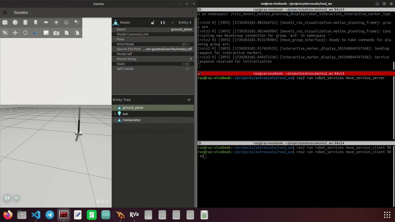
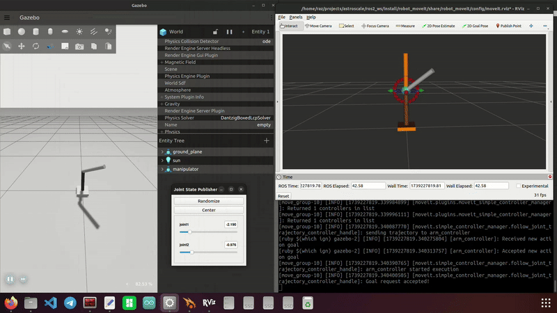

# Astroscale ROS2 Manipulator Project

This repository contains a ROS 2 Humble package for a 2-DOF manipulator. The project was developed as a home assignment for Astroscale. It uses the MoveIt 2 API to implement a service for moving the manipulator to a specified position using Inverse Kinematics (IK).

**Check out my other manipulator project!**  
👉 [ArduinoBot Manipulator Project](https://github.com/RazTurgeman97/manipulator-project)  
*A ROS2-based robotic arm with Arduino integration for hardware control.*  

## Project Overview

The project consists of the following components:
1. **URDF/XACRO Model**: A 2-DOF manipulator with three links (`base_link`, `forearm_link`, `hand_link`) and two active joints (`joint1`, `joint2`).
2. **MoveIt 2 Integration**: Configuration for motion planning and Inverse Kinematics.
3. **ROS 2 Services**: A `move_to_position` service to command the manipulator.
4. **Launch System**: Python-based launch files for visualization, simulation, and control.
5. **ROS 2 Control**: Configuration for hardware interfaces (simulated in this case).

---

## Demonstration GIFs

### Command Control Interface


### Slider Control Interface


---

## Table of Contents
- [Project Overview](#project-overview)
- [Demonstration GIFs](#demonstration-gifs)
- [Workspace Configuration](#workspace-configuration)
  - [Dependencies](#dependencies)
  - [Installation](#installation)
- [Architecture](#architecture)
  - [URDF/XACRO Model](#urdfxacro-model)
  - [MoveIt 2 Configuration](#moveit-2-configuration)
  - [Services](#services)
- [Launching the System](#launching-the-system)
- [Usage](#usage)
  - [Using the Service Server and Client](#using-the-service-server-and-client)
  - [Using the Slider Control Interface](#using-the-slider-control-interface)
- [Repository Structure](#repository-structure)
- [Key Features](#key-features)

---

## Workspace Configuration

### Dependencies
- **ROS 2 Humble**
- **MoveIt 2**
- **rviz2**
- **Gazebo**
- **ros2_control**

### Installation
1. Clone this repository and install requirements:
   ```bash
   git clone https://github.com/RazTurgeman97/Astroscale_Home_Assignment.git
   cd Astroscale_Home_Assignment
   sudo apt-get update
   xargs sudo apt install -y < requirements.txt
   ```
2. Build the workspace and source it:
   ```bash
   cd ros2_ws
   rm -rf log build install
   colcon build
   source install/setup.bash
   ```

---

## Architecture

### URDF/XACRO Model
- **Location**: `robot_description/urdf/`
- **Key Files**:
  - `manipulator.urdf.xacro`: Main robot description
  - `common_properties.xacro`: Material and dimension definitions
  - `robot_ros2_control.xacro`: Control interface configuration
- **Joints**:
  - `virtual_joint`: Fixed connection to the world frame
  - `joint1`: Revolute (-180° to 180°), connects base to forearm
  - `joint2`: Revolute (-90° to 90°), connects forearm to hand

### MoveIt 2 Configuration
- **Package**: `robot_moveit`
- **Launch File**: `moveit.launch.py` loads the MoveIt 2 setup

### Services
- **Package**: `robot_services`
- **Service Type**: `robot_msgs/srv/MoveToPosition`
- **Nodes**:
  - `move_service_server.cpp`: Service server (C++)
  - `move_service_client.cpp`: Service client (C++)

---

## Launching the System

### Launch Files
The project can be launched with one launch file and has two control options:
1. **Control using commands from the terminal through a service server**:
   ```bash
   ros2 launch robot_bringup command_control_simulation.launch.py
   ```
2. **Control using sliders**:
   ```bash
   ros2 launch robot_bringup slider_control_simulation.launch.py
   ```

These launch files contain other launch files:
1. **Visualization** (RViz):
   ```bash
   ros2 launch robot_description display.launch.py
   ```
2. **MoveIt 2 Planning**:
   ```bash
   ros2 launch robot_moveit moveit.launch.py
   ```
3. **Gazebo Simulation**:
   ```bash
   ros2 launch robot_description gazebo.launch.py
   ```
4. **Controller Interface**:
   ```bash
   ros2 launch robot_controller controller.launch.py
   ```

---

## Usage

### Using the Service Server and Client
Once the command control interface is running (using the `command_control_simulation.launch.py` launch file), open a new terminal and run:
```bash
ros2 run robot_services move_service_server
```

In another new terminal, run:
```bash
ros2 run robot_services move_service_client <joint1> <joint2>
```
Replace `<joint1>` and `<joint2>` with values within the joint boundaries ([-180, 180] and [-90, 90], respectively).

### Using the Slider Control Interface
Once the slider control interface is running, you can control the manipulator joints using the GUI. To start the slider control interface, use the following command:
```bash
ros2 launch robot_bringup slider_control_simulation.launch.py
```

---

## Repository Structure
```
Astroscale_Home_Assignment/
└── ros2_ws/
    └── src/
        ├── robot_bringup/              # Launch configurations
        │   ├── launch/
        │       ├── command_control_simulation.launch.py
        │       └── slider_control_simulation.launch.py
        ├── robot_controller/           # Control interfaces
        │   ├── config/
        │   │   └── robot_controllers.yaml
        │   ├── launch/
        │   │   ├── controller.launch.py
        │   │   └── slider_controller.launch.py
        │   ├── robot_controller/
        │   │   ├── __init__.py
        │   │   └── slider_control.py
        │   └── src/
        │       └── slider_control.cpp
        ├── robot_description/          # Robot model
        │   ├── launch/
        │   │   ├── display.launch.py
        │   │   └── gazebo.launch.py
        │   ├── rviz/
        │   │   └── display.rviz
        │   └── urdf/
        │       ├── common_properties.xacro
        │       ├── manipulator.urdf.xacro
        │       ├── robot_gazebo.xacro
        │       └── robot_ros2_control.xacro
        ├── robot_moveit/               # MoveIt 2 integration
        │   ├── config/
        │   │   ├── initial_positions.yaml
        │   │   ├── joint_limits.yaml
        │   │   ├── kinematics.yaml
        │   │   ├── manipulator.srdf
        │   │   ├── moveit.rviz
        │   │   ├── moveit_controllers.yaml
        │   │   ├── pilz_cartesian_limits.yaml
        │   │   └── planning_python_api.yaml
        │   └── launch/
        │       └── moveit.launch.py
        ├── robot_msgs/                 # Service configurations
        │   └── srv/
        │       └── MoveToPosition.srv
        └── robot_services/             # Service nodes
            └── src/
                ├── move_service_client.cpp
                └── move_service_server.cpp
```

---

## Key Features
- **Modular XACRO Design**: Easy parameter modification through `common_properties.xacro`
- **Dual Launch Systems**: Support for both command-based and slider control
